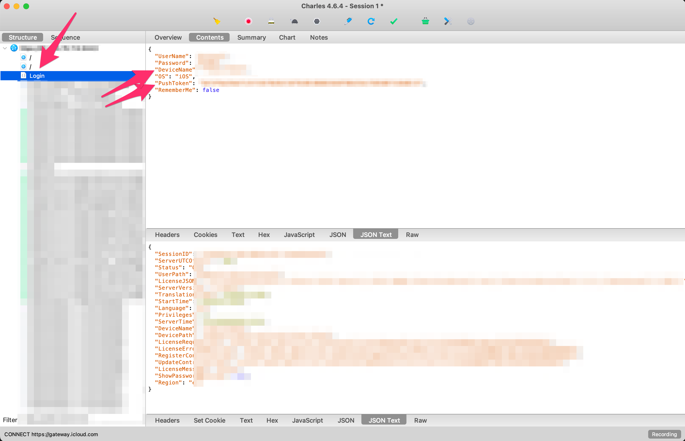
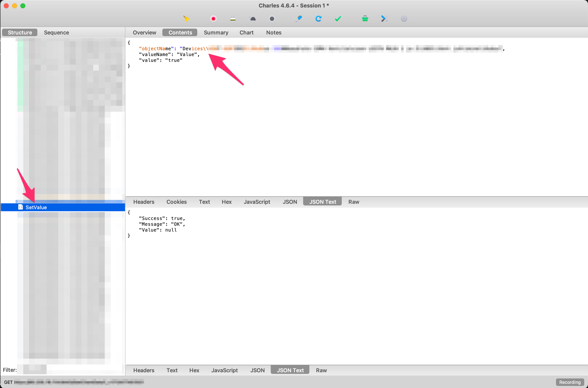
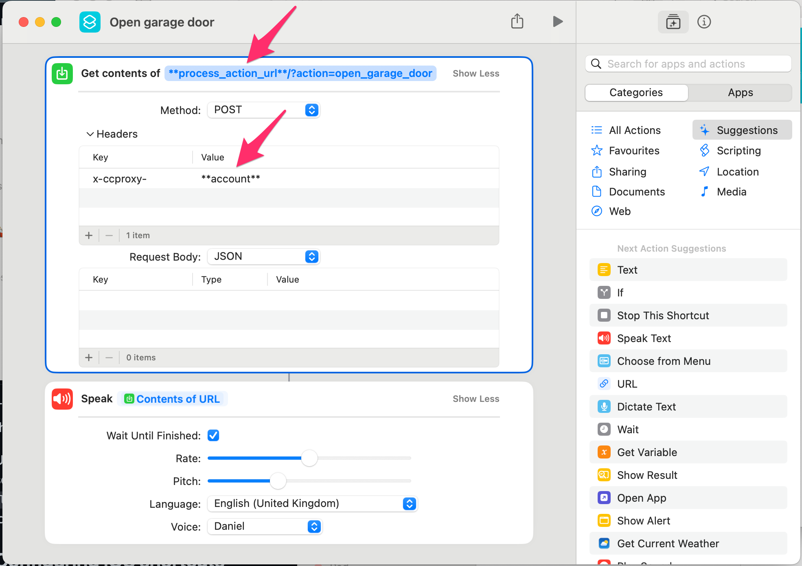

# ccproxy [](https://github.com/sergeil/ccproxy/actions/workflows/ci.yml)

This proxy was built with an intention to simplify integration with ComfortClick smart home interface. Initial use-case behind its design - making it possible to use ComfortClick's functions via Siri shortcuts.

Once ccproxy is configured, you will get a bunch of endpoints that you can use to trigger certain actions at your place. How you invoke these endpoints - it's up to you to decide. Speaking of my personal use-case - I have certain actions at my place triggered via Siri shortcuts, using voice. For example, it's super convenient when arriving to a garage to have a door opened by just saying "Hey Siri, open garage door", as opposed to reaching out to the phone and using a mobile app for that. In "Hey Siri" case, what actually happens behind the scene is that Siri shortcut will issue a simple HTTP request to ccproxy, the latter will emulate mobile app's request, take care of the authentication and send it to the ComfortClick's server. The latter wouldn't even know that the request was actually issued by something else than the original mobile app.

The whole solution is deployed on a serveless stack, hence with a regular usage it will
literally cost you nothing, as you're only charged for actual Lambda requests processed, not for the time you have them deployed.

This proxy is not in any way affiliated with the original ComfortClick, it is a result
of me reverse-engineering the protocol and building a proxy around it. So, as the saying goes - use it at your own risk.

# Installation

Disclaimer: the installation process, even though a major part of it is automated, without
having previous knowledge of AWS, traffic-inspecting tools (such as Charles) and basic command line skills, it may take some time to follow through.

So, with the desclaimer out of the way, if you're still up for a challenge, buckle up and let's make it happen 🤘.

## Prerequisites

### AWS account

You need to have an AWS [account](https://docs.aws.amazon.com/streams/latest/dev/setting-up.html) which has API access enabled. That account must also have `AdministratorAccess` policy attached to it (can be achieved by having the account added to `Administrators` group).

Also you need to add account of yours to `~/.aws/credentials` (if file doesn't exist, create it), e.g.:

```
[ccproxy]
aws_access_key_id = ...
aws_secret_access_key = ...
```

More information on the credentials file [here](https://docs.aws.amazon.com/cli/latest/userguide/cli-configure-files.html). Replace `...` above with your access and secret keys respectively. `ccproxy` is a AWS profile name, no need to change it unless you're planning
to tweak the deployment process or make functional changes to the project.

### Docker and Terraform installed locally

You need to have [Docker](https://www.docker.com/products/docker-desktop/) and
[Terraform](https://developer.hashicorp.com/terraform/install?product_intent=terraform) installed on your machine.

## Creating `.env.prod` file

The installation process starts with you creating a copy of `.env.dist` and naming it
`.env.prod`. In the latter we will need to change a few environment variables:

- `PUSH_TOKEN`
- `DEVICE_NAME`
- `DB_ENCRYPTION_KEY`

When a native ComfortClick's mobile application does a login, it sends your phone's push token and device name to its server, so we will need to use a network sniffing tool to find these values (as explained below in the doc). Last variable, `DB_ENCRYPTION_KEY`'s value is used to encrypt sensitive content (e.g. passwords) when it is stored in ccproxy's database.

### Finding your phone's PUSH_TOKEN and DEVICE_NAME

To find out what your device name and ComfortClick app's push token are, you need to use a traffic sniffing tool such as [Charles](https://www.charlesproxy.com/). Once you installed it, you will need to change your phone's Wifi connection settings as explained in [this guide](https://www.charlesproxy.com/documentation/faqs/using-charles-from-an-iphone/) (here's a [few more words](https://www.charlesproxy.com/documentation/proxying/ssl-proxying/) on how to configure SSL proxying, so you could see the requests' contents). Once you ensured that Charles acts as a proxy for traffic from your phone, then follow these steps:

- Launch ComfortClick app and follow the login process
- Open Charles, find `Login` request
- In the request payload you can find `DeviceName` and `PushToken`. These will correspond to `DEVICE_NAME` and `PUSH_TOKEN` in `.env.prod` respectively, go ahead and update the `.env.prod` file.



Congrats! The most difficult part of the setup process should be done by now. Don't close Charles yet though, we will need it to configure ccproxy's `actions`. The next section covers exactly that.

## Configuring "actions"

Now we're going to start configuring `actions`, that's how in the context of ccproxy different types of, well, functions that you can trigger at your home via smart interface are called. For example, opening garage is an `action` as well as turning on/off ventilation.

Here we will once again need to resort to Charle's help - make sure it's still running and your phone's requests are being proxied via it. Then, open ComfortClick's app on your phone and press a function that you later want to be accessible via Siri shortcut. For example, open a garage door. Once you pressed that function in the app, jump back to Charles and find the request that the app has made via calling to `SetValue` endpoint. For example:



Write down a value of `objectName` key somewhere. Repeat the action for all actions
that you want to make accessible via ccproxy.

Once you compiled a list of all `objectName`s you're interested in, create a copy of `config.json.dist`, name it `config.json` and start editing its contents, as explained in a next section.

### Editing `config.json`

The file contains two root-level keys - `messages` and `actions`:

- `actions` - key corresponds to an alias that you will be using to invoke a given action, value - a string that you got from `SetValue` request (use of the key will be explained in `Configuring iOS shortcuts` section later)
- `messages` - a piece of text that will be returned from ccproxy when a certain action is invoked. You can configure Siri Shortcut to do a voiceover for that (ccproxy ships a ready-made shortcut that you can re-use, so no worries)

To make it a bit more tangible - say you have an action of opening a garage in ComfortClick that is represented by `Tasks\\Garage door` objectName. To be able to invoke
that trigger via ccproxy, you can make your `config.json` look similar to this:

```
{
  "messages": {
    "open_garage_door": [
      "Roger that, opening"
    ]
  },
  "actions": {
    "open_garage_door": "Tasks\\Garage door"
  }
}
```

So, following the example above, add a bunch of `messages` and `actions` for all the
`objectName`s that you collected in a previous section. Make sure that for every action
that you add, there's also corresponding value in `messages`.

Once you finished editing `config.json`, we can finally proceed and deploy the whole
thing to AWS 🚀.

## Deploying

The deployment of ccproxy is fully automated, just run `make setup` script
and it will guide you through the process.

Upon completion of the setup, the script will provide you with `process_action_url` and `login_url`. In the next section, when setting up iOS shortcuts, we will need `process_action_url`, so write it down somewhere. As to `login_url` - feel free to discard
it for now, you don't need to use it directly to finish `ccproxy` setup proces, as the login process is automated by `./deployment/bin/login.sh` script.

🚨 Important gotcha 🚨: whenever you change something in `config.json`, you need to run the following command to have it deployed: `make build-package && make infra`

## Creating account

Before you can start triggering actions via, say, iOS shortcuts, you need to create
an account on ccproxy. The action will later be used by ccproxy to authenticate
on your behalf to your ComfortClick server. The goods news is that in order to create an
account, all you need to do is to just invoke `./deployment/bin/login.sh` script. The script will ask your for ComfortClick app host, username and password, these you can find
if you go open to the mobile app and navigate to settings.

## Configuring iOS shortcuts

Congrats, you've made it that far! 💪

Now we're getting to phase where everything that has been done so far will start coming together - we're about to configure iOS shortcuts so you could trigger actions at your place via, say, "Hey, Siri" commands.

The ccproxy ships a sample shortcut that you can import into your library, tweak a couple
things to get it going. Navigate to `shortcuts` directory in this repository, there you will find `Open garage door` shortcut, go ahead and import it.



Once the shortcut is imported, go ahead and:

- replace `**process_action_url**` with the a corresponding value that you've got when you ran `./deployment/bin/setup.sh`
- replace `**account**` with a value that you got after running `./deployment/bin/login.sh`

Once this is done, you can run the shortcut, it will issue a request to a ccproxy, ccproxy
will authenticate to ComfortClick's server and trigger an action on your behalf. Then
ccproxy will return "Roger that, opening" response and Shortcut will voice it over for you.

You can duplicate the shortcut for as many different actions as you defined in your `config.json`. In the setup guide we've referred to an imaginary ComfortClick's `Tasks\\Garage door` represented by `open_garage_door` action on `ccproxy`, but play around with your ComfortClick app and feel free to create more shortcuts - e.g. turning on/off ventilation, opening hallways door etc.

## License

[MIT License](https://opensource.org/licenses/MIT) Copyright © 2024-present, Sergei Lissovski
